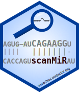

[](https://doi.org/10.1093/bioinformatics/btac110) 
[](https://github.com/ETHZ-INS/scanMiR/actions)


# scanMiR

`scanMiR` is a bioconductor set of tools for working with miRNA affinity
models (KdModels), enabling efficient and flexible scanning for miRNA binding 
sites and prediction of target repression.

<br/>

## Getting started

### Installation

```{r}
BiocManager::install("ETHZ-INS/scanMiR")
```

### Basic example usage

```{r}
# accepts miRNA target seeds:
findSeedMatches(seqs, seeds="AAACCAC")
# full miRNA sequences:
findSeedMatches(seqs, seeds="UUAAUGCUAAUCGUGAUAGGGGUU")
# or KdModels:
findSeedMatches(seqs, seeds=model)
```

```
GRanges object with 43 ranges and 4 metadata columns:
       seqnames    ranges strand |  p3.score          type    log_kd     note
          <Rle> <IRanges>  <Rle> | <integer>      <factor> <integer>    <Rle>
   [1]     seq2 2687-2694      * |         4 7mer-a1           -3607        -
   [2]     seq2 2358-2365      * |         0 6mer              -2341        -
   [3]     seq2 2550-2557      * |         0 6mer-m8            -986        -
   [4]     seq2 1642-1649      * |         0 non-canonical      -952        -
   [5]     seq2   920-927      * |         0 non-canonical      -847        -
   ...      ...       ...    ... .       ...           ...       ...      ...
```

The putative 3' binding of each match can also be visualized:

```{r}
viewTargetAlignment(matches[1], miRNA=model, seqs=seqs)
```
```
miRNA            3'-UUGGGGAUAGUGCUA---AUCGUAAUU-5'     
                              |||||     ||||||-        
target 5'-...NUAUAGACGAGUGACCUACGAUAUGCCGCAUUAAUU...-3'
```

<br/><br/><br/>

`scanMiR` can predict TDMD and circRNA slicing sites, and aggregate sites to 
predict repression based on the biochemical model from 
[McGeary, Lin et al. (2019)](https://dx.doi.org/10.1126/science.aav1741). For 
more information, see our [paper](https://doi.org/10.1093/bioinformatics/btac110).

To learn more about the functionalities, see the package's 
[vignettes](https://www.bioconductor.org/packages/devel/bioc/vignettes/scanMiR/inst/doc/scanning.html).
To obtain predicted `KdModels` for all mouse, human and rat miRbase miRNAs, see the 
[scanMiRData](https://github.com/ETHZ-INS/scanMiRData) pacakge.

For convenient wrappers connecting to AnnotationHub, fast out-of memory access 
to large collections, or a web interface to scanMiR, see the 
[scanMiRApp](https://github.com/ETHZ-INS/scanMiRApp) package.
